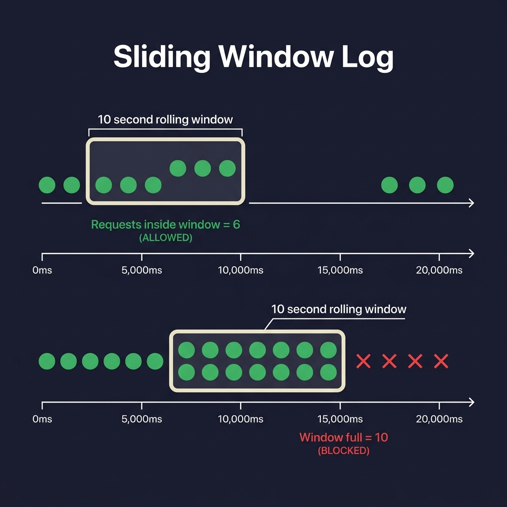
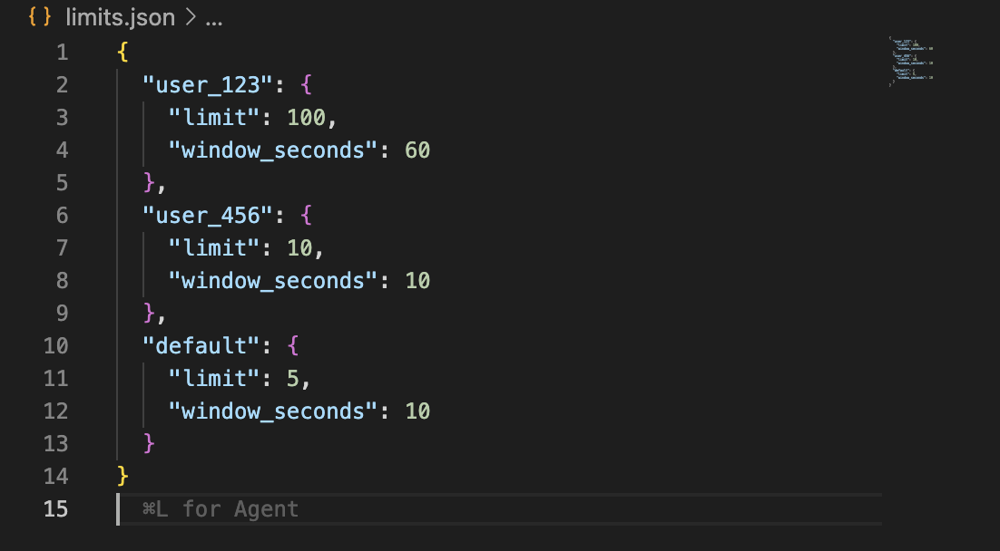
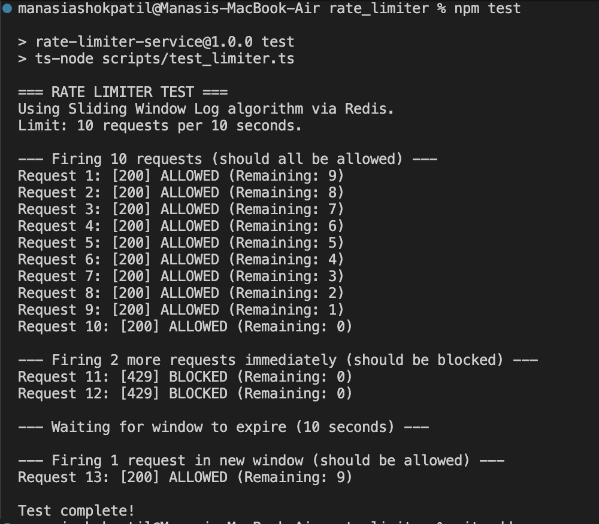

# Rate Limiter Microservice

A simple API rate limiter I built to understand how real-world systems like GitHub, Twitter, and Stripe prevent users from spamming their APIs. It uses the **Sliding Window Log** algorithm with Redis to accurately track and limit requests.

## What is a Rate Limiter?

A rate limiter is basically a bouncer for your API. It checks every incoming request and decides: "Has this user made too many requests recently? If yes, block them."

This project implements that as a standalone microservice — any backend can call it to check if a request should be allowed or blocked.

## The Algorithm — Sliding Window Log

I used the **Sliding Window Log** algorithm because it's more accurate than the basic fixed-window approach (which has a known "boundary spike" bug where users can double their limit at the edge of a window).

Here's how it works:



**The idea:**
- Every request is logged with a timestamp in Redis (a sorted set).
- When a new request comes in, we delete all old timestamps that are older than the time window (e.g., older than 10 seconds).
- We then count what's left. If the count is under the limit → allow it. If not → block it.
- The window "slides" with real time, so there's no cheating at window boundaries.

To make this thread-safe (no race conditions when two requests arrive at the same millisecond), I wrote the logic as a **Lua script** that runs directly inside Redis atomically.

## Tech Stack

- **Node.js + TypeScript** — Backend server
- **Express.js** — API framework
- **Redis** — Stores request timestamps
- **Docker** — Runs Redis in a container
- **Lua** — Custom script for atomic Redis operations

## Project Structure

```
rate_limiter/
├── docker-compose.yml     # Runs Redis
├── limits.json            # Per-user rate limit config
├── src/
│   ├── index.ts           # Express API server
│   ├── redis.ts           # Redis connection
│   └── rateLimiter.ts     # Sliding Window algorithm (Lua)
└── scripts/
    └── test_limiter.ts    # Test script
```

## Configuration

Rate limits are set per user in `limits.json`. No database needed!



Any user not listed falls back to the `default` rule.

## How to Run

**1. Start Redis:**
```bash
docker compose up -d
```

**2. Start the server:**
```bash
npm install
npm run dev
```

**3. Test the rate limiter (in a new terminal):**
```bash
npm test
```

## Test Output

Here's what the test looks like when you run it:



The test:
1. Fires 10 requests instantly — all allowed
2. Fires 2 more immediately — both blocked (limit hit)
3. Waits 10 seconds for the window to expire
4. Fires 1 final request — allowed again (fresh window)

## API Usage

**POST `/check`**

```bash
curl -X POST http://localhost:3000/check \
  -H "Content-Type: application/json" \
  -d '{"client_id": "user_456"}'
```

**Allowed response:**
```json
{
  "message": "Request allowed",
  "allowed": true,
  "remaining": 9
}
```

**Blocked response (HTTP 429):**
```json
{
  "error": "Too Many Requests",
  "allowed": false,
  "remaining": 0
}
```
